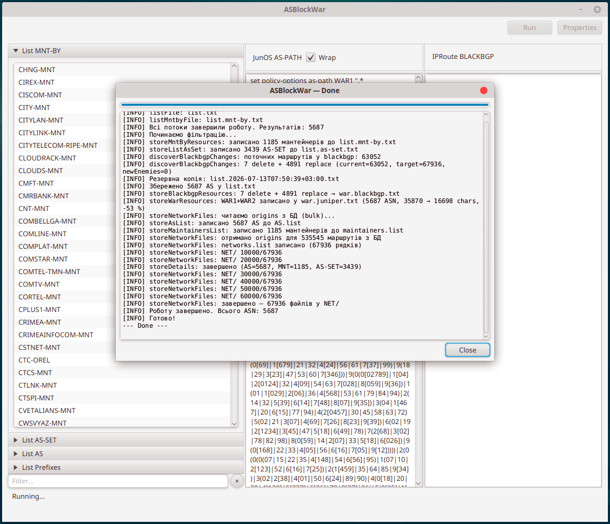
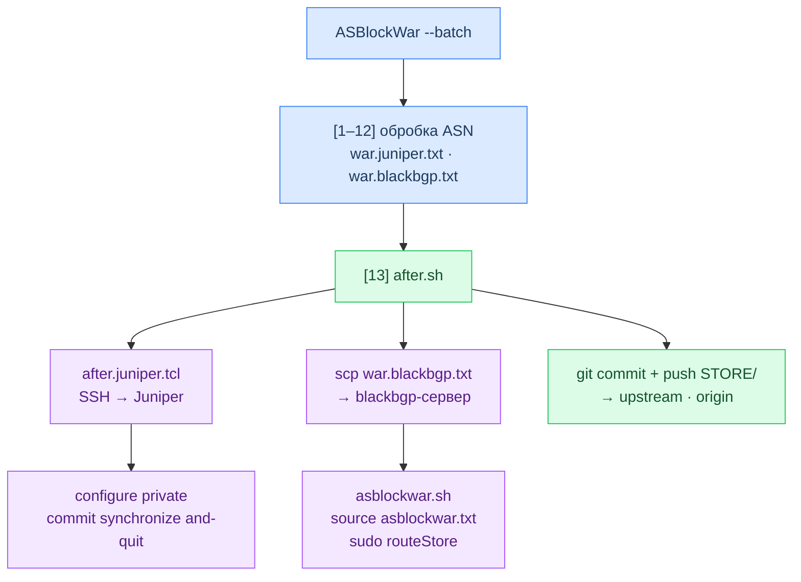

# ASBlockWar

Утиліта для автоматичного супроводу списку ворожих автономних систем (AS), що підлягають блокуванню.

Зчитує поточний перелік ASN, звіряє їх з локальною копією бази RPSL ([whois-lite-local](https://github.com/oldengremlin/whois-lite-local)), знаходить нові ASN через mnt-by/as-set зв'язки та AS-SET-и з import/export-політик, фільтрує за патерном агресора й оновлює список на диску. Додатково звіряє поточний стан blackhole-маршрутизації (blackbgp) через SSH і генерує diff-команди. Після виконання виводить звіт про зміни.

Починаючи з версії 3.0.0 доступний повноцінний **графічний інтерфейс** (`-g` / `--gui`) з живим відображенням процесу обробки, з 3.3.0 — **пакетний режим** (`-b` / `--batch`) для автоматичного запуску зовнішнього скрипту, а з 3.5.0 — **граф залежностей** (`-dg` / `--dependency-graph`) у вигляді інтерактивного HTML/SVG+D3.js з опціональним sfdp pre-computed layout. Поточна версія — **3.7.2**.

📋 [Changelog](docs/CHANGELOG.md) · 🛠 [Contributing / внутрішня архітектура](docs/CONTRIBUTING.md)

---

## Вимоги

| Компонент | Версія |
|---|---|
| Java | 25+ |
| Maven | 3.6+ |
| [whois-lite-local](https://github.com/oldengremlin/whois-lite-local) | актуальна база `whoislitelocal.db` |

База `whoislitelocal.db` має бути заповнена утилітою `whois-lite-local` до запуску ASBlockWar. Дивись [DATABASE.md](https://github.com/oldengremlin/whois-lite-local/blob/main/docs/DATABASE.md) за структурою схеми.

> JavaFX вбудований у fat-JAR — окрема установка не потрібна.

---

## Збірка

Є два варіанти збірки.

### Варіант 1: fat-JAR (`mvn clean package`)

```bash
mvn clean package
```

Збирається fat-JAR з усіма залежностями (через maven-shade-plugin):

```
target/ASBlockWar-3.7.2-<buildNumber>.jar
```

Запуск потребує встановленої JRE 25+ на цільовій машині:

```bash
java -jar target/ASBlockWar-3.7.2-00000001.jar [параметри]
```

### Варіант 2: native app image (`mvn clean verify`)

```bash
mvn clean verify
```

Окрім fat-JAR, збирається автономний образ застосунку (через jpackage-maven-plugin, тип `APP_IMAGE`) — директорія зі збудованим JRE та власним лаунчером:

```
target/ASBlockWar/
```

Запуск не потребує встановленої JRE:

```bash
target/ASBlockWar/bin/ASBlockWar [параметри]
```

> Якщо Maven не може завантажити залежності через проблеми з IPv6:
> ```bash
> MAVEN_OPTS="-Djava.net.preferIPv4Stack=true" mvn clean verify
> ```

---

## Конфігурація

Конфігураційний файл не є обов'язковим. Якщо він не заданий і не вбудований у JAR, використовуються значення за замовчуванням для всіх властивостей:

```properties
ListFile=list.txt
ListMntbyFile=list.mnt-by.txt
ListAssetFile=list.as-set.txt
WhoisLiteLocalURI=jdbc:sqlite:whoislitelocal.db
StoreDir=./STORE
WarFile=war.juniper.txt
BlackbgpFile=war.blackbgp.txt
GetBlackhole=ssh blackbgp "sudo ip r l t blackbgp"
GetBlackholeIpv6=ssh blackbgp "sudo ip -6 r l t blackbgp"
BlackbgpIpv6=true
BlockCountry=RU
ForceASBlock=
ForceNETBlock=
AggressorPattern=(?im)^(org-name:.*(Kaspersky|Qrator).*|country:.*ru|phone:[^+]*\+7.*|address:.*(mos[ck]ow|russ?ia).*|abuse-mailbox:.*\.ru)$
BatchMode=false
AfterCommand=after.sh
DependencyGraph=
UseSfdp=true
DependencyWithUnknown=false
PrimaryEnemyResources=AS-MAILRU,AS-VKONTAKTE,AS-VK,AS-YANDEX,AS-M100
```

За потреби перед збіркою можна створити файл `src/main/resources/asblockwar.properties` на основі зразка нижче — він вбудовується у JAR при `mvn package` і завантажується з classpath.

```properties
# Шлях до файлу зі списком ASN (по одному числу на рядок)
ListFile=list.txt

# Шлях до файлу зі списком mnt-by хендлів
ListMntbyFile=list.mnt-by.txt

# Шлях до файлу зі списком AS-SET-ів
ListAssetFile=list.as-set.txt

# JDBC URI до бази даних whois-lite-local
WhoisLiteLocalURI=jdbc:sqlite:/path/to/whoislitelocal.db

# Директорія для зберігання RPSL-деталей (aut-num, mntner, routes, as-set)
StoreDir=./STORE

# Шлях до файлу Juniper WAR-конфігурації (виходить з storeWarResources)
WarFile=war.juniper.txt

# Шлях до файлу з diff-командами blackbgp (виходить з storeBlackbgpResources)
BlackbgpFile=war.blackbgp.txt

# Команда читання поточного стану таблиці blackbgp (IPv4)
GetBlackhole=ssh blackbgp "sudo ip r l t blackbgp"

# Команда читання поточного стану blackbgp (IPv6)
GetBlackholeIpv6=ssh blackbgp "sudo ip -6 r l t blackbgp"

# Враховувати IPv6-маршрути у blackbgp (true за замовчуванням)
BlackbgpIpv6=true

# Обов'язковий перелік кодів країн через кому — AS без цього country не блокується
BlockCountry=RU

# Перелік ASN для примусового блокування через кому (обходять country + AGGRESSOR_PATTERN)
# Підтримується будь-який регістр і формат: AS209671, as209671, 209671 — зберігається як AS209671
ForceASBlock=

# Перелік мереж/хостів через кому для примусового додавання до blackbgp (тільки blackbgp, без WAR)
# Без CIDR-нотації хост доповнюється /32 (IPv4) або /128 (IPv6) автоматично
ForceNETBlock=

# Regex для виявлення ворожих RPSL-блоків (застосовується після country-фільтра)
# Синтаксис: Java regex. Зберігається без подвоєння зворотних слешів (Properties екранує автоматично)
AggressorPattern=(?im)^(org-name:.*(Kaspersky|Qrator).*|country:.*ru|phone:[^+]*\+7.*|address:.*(mos[ck]ow|russ?ia).*|abuse-mailbox:.*\.ru)$

# Пакетний режим: запускати скрипт після завершення обробки
BatchMode=false

# Шлях до скрипту, що виконується у пакетному режимі
AfterCommand=after.sh

# Шлях до HTML-файлу графа залежностей (порожньо = вимкнено; також керується через -dg)
DependencyGraph=

# Використовувати sfdp для pre-computed layout графа (true) або D3 force-simulation (false)
# При true: граф відкривається миттєво, layout компактний (потребує graphviz у PATH)
# При false: D3 будує граф у браузері, органічна «супернова», але повільно на великих графах
UseSfdp=true

# Включати вузли зі статусом UNKNOWN до графа залежностей (false за замовчуванням)
# При false: залишаються лише BLOCKED/SUSPICIOUS/CLEAR вузли та їхня інфраструктура
# При true: повний граф з усіма member-ASN та мантейнерами без статусу (набагато більший)
DependencyWithUnknown=false

# Перелік AS-SET-ів через кому, що вважаються «ворожими ресурсами» у граф-пошуку
# Ці ідентифікатори виступають цілями алгоритму Дейкстри у граф-панелі браузера
# Редагується також через поле «Primary enemy resources» у діалозі Properties
PrimaryEnemyResources=AS-MAILRU,AS-VKONTAKTE,AS-VK,AS-YANDEX,AS-M100
```

Альтернативно — зовнішній конфіг через аргумент `--config=`:

```bash
java -jar ASBlockWar-3.6.16-00000001.jar --config=/etc/asblockwar/asblockwar.properties
```

---

## Вхідні файли

### `list.txt` — список ASN для блокування

По одному числу на рядок. Рядки, що починаються з `#` або `;`, ігноруються.

```
# Список ворожих AS
12389
25159
208398
```

### `list.mnt-by.txt` — список mnt-by хендлів

Кожен хендл — ідентифікатор мейнтейнера RIPE. Рядки-коментарі ігноруються.

```
# Мейнтейнери
ROSNIIROS-MNT
RIPE-NCC-RPSL-MNT-RU
```

Файл ведеться автоматично: нові мейнтейнери, знайдені через `mnt-by:` у RPSL-блоках нещодавно виявлених ворожих ASN, дописуються при кожному запуску. Вручну додані записи також зберігаються. Файл перезаписується відсортованим, тому ручні записи можна вносити у будь-якому порядку.

> Службові мантейнери RIPE (`RIPE-*`, наприклад `RIPE-NCC-HM-MNT`) автоматично виключаються — вони присутні в будь-якому RPSL-записі і не є ознакою належності до агресора.

### `list.as-set.txt` — список AS-SET-ів для перевірки членства

Ідентифікатори AS-SET-ів (по одному на рядок), члени яких перевіряються на ознаки ворожого ASN. Рядки-коментарі ігноруються.

```
AS-MAILRU
AS-YANDEX
AS-VK
```

Файл виконує подвійну роль:

- **Вхідний**: записи, додані вручну, завантажуються при запуску і їх члени перевіряються нарівні з елементами `PrimaryEnemyResources`. Це дозволяє розширювати список AS-SET-ів без перекомпіляції.
- **Вихідний**: AS-SET-и, виявлені автоматично через `import`/`export`-поля ворожих ASN, а також всі елементи `PrimaryEnemyResources`, записуються при кожному запуску. Файл перезаписується відсортованим. Імена з trailing `;` (артефакт RPSL-парсингу) очищаються автоматично.

Елементи `PrimaryEnemyResources` (за замовчуванням: `AS-MAILRU`, `AS-VKONTAKTE`, `AS-VK`, `AS-YANDEX`, `AS-M100`) завжди обробляються та записуються у файл незалежно від його поточного вмісту.

---

## Запуск

```bash
java -jar target/ASBlockWar-3.7.2-00000001.jar [параметри]
```

### Параметри командного рядка

| Параметр | Опис |
|---|---|
| `-g`, `--gui` | Запустити графічний інтерфейс (JavaFX) |
| `--config=<шлях>` | Зовнішній конфігураційний файл (за замовчуванням — вбудований) |
| `--list-file=<шлях>` | Файл зі списком ASN (за замовчуванням: `list.txt`) |
| `--list-mnt=<шлях>` | Файл зі списком mnt-by хендлів (за замовчуванням: `list.mnt-by.txt`) |
| `--list-asset=<шлях>` | Файл зі списком AS-SET-ів (за замовчуванням: `list.as-set.txt`) |
| `--whois-uri=<uri>` | JDBC URI до бази whois-lite-local (за замовчуванням: `jdbc:sqlite:whoislitelocal.db`) |
| `--store-dir=<шлях>` | Директорія для STORE-файлів (за замовчуванням: `./STORE`) |
| `--war-file=<шлях>` | Вихідний файл Juniper WAR (за замовчуванням: `war.juniper.txt`) |
| `--blackbgp-file=<шлях>` | Вихідний файл diff-команд blackbgp (за замовчуванням: `war.blackbgp.txt`) |
| `--get-blackhole=<cmd>` | Команда читання поточного стану blackbgp, IPv4 |
| `--get-blackhole6=<cmd>` | Команда читання поточного стану blackbgp, IPv6 |
| `-6`, `--ipv6` | Враховувати IPv6-маршрути в blackbgp-звірці (увімкнено за замовчуванням) |
| `-no6`, `--no-ipv6` | Вимкнути IPv6-маршрути в blackbgp-звірці |
| `--block-country=<CC,...>` | Перелік кодів країн через кому для обов'язкового country-фільтра (за замовчуванням: `RU`) |
| `--force-as=<AS,...>` | ASN через кому для примусового блокування, обходять country + AGGRESSOR_PATTERN |
| `--force-net=<pfx,...>` | Мережі/хости через кому для примусового додавання до blackbgp (тільки blackbgp) |
| `--aggressor-pattern=<rx>` | Regex-патерн для виявлення ворожих RPSL-блоків (перекриває конфігурацію) |
| `--recursive-asset` | Рекурсивно заходити у вкладені AS-SET-и (глибина 1) |
| `--recursive-asset=N` | Рекурсія до глибини N |
| `-b`, `--batch` | Пакетний режим: запустити `AfterCommand` після обробки |
| `--after-command=<шлях>` | Скрипт для пакетного режиму (за замовчуванням: `after.sh` / `after.cmd`) |
| `-dg`, `--dependency-graph` | Згенерувати HTML-граф залежностей (за замовчуванням: `dependency-graph.html`) |
| `-dg=<шлях>`, `--dependency-graph=<шлях>` | Задати власний шлях для HTML-файлу графа |
| `--primary-enemy=<items,...>` | AS-SET-и через кому, що **додаються** до `PrimaryEnemyResources` (адитивно, не замінює значення з файлу конфігурації) |
| `-h`, `--help` | Вивести довідку та вийти |

---

## Графічний інтерфейс (GUI)

```bash
java -jar target/ASBlockWar-3.7.2-00000001.jar --gui
```

### Головне вікно

Головне вікно складається з трьох колонок:

- **Ліва колонка — акордеон із чотирма вкладками:**
  - *List MNT-BY* — список mnt-by хендлів з `list.mnt-by.txt`
  - *List AS-SET* — список AS-SET-ів з `list.as-set.txt`
  - *List AS* — список ASN з `list.txt`
  - *List Prefixes* — активні blackhole-префікси з `STORE/networks.list` (лише стовпець prefix)

  Під акордеоном розташоване поле фільтра з кнопкою-хрестиком «×» (кругла). Фільтр діє на активну вкладку і зберігає свій стан окремо для кожної з чотирьох вкладок. Фільтрування відбувається в пам'яті (без запитів до БД) і реагує на кожен введений символ.
- **Центральна колонка** — вміст згенерованого `war.juniper.txt` (JunOS AS-PATH), з можливістю ввімкнути перенесення рядків через чекбокс *Wrap*.
- **Права колонка** — вміст згенерованого `war.blackbgp.txt` (IPRoute BLACKBGP).

Після кожного виконання (Run) та після закриття вікна Properties усі панелі перечитуються з диска.

### Кнопки панелі інструментів

| Кнопка | Дія |
|---|---|
| **Run** | Відкриває діалог виконання та запускає повний цикл обробки |
| **Dependency** | Пропонує вибір: зовнішній браузер (рекомендовано) або WebView; активна лише після Run |
| **Properties** | Відкриває діалог редагування конфігурації |

### Діалог виконання (Run Progress)

Відкривається при натисканні *Run*. Відображає живий лог виконання (рівні INFO та вище) у вбудованому **WebView** та невизначений індикатор прогресу. Кнопка *Close* стає активною тільки після завершення або помилки. Закрити вікно хрестиком під час виконання неможливо.

Лог підтримує **виділення тексту мишею та копіювання** через Ctrl+C — зручно для копіювання номерів AS із звіту без перенабору вручну. Колірна схема автоматично підлаштовується під системну тему (світла/темна).

У пакетному режимі (`-b` / `--batch`) після завершення обробки у тій само панелі відображається вивід `AfterCommand`-скрипту: рядки зі stderr виводяться червоним кольором, рядки зі stdout — стандартним текстом.



#### Живе підсвічування

Під час обробки акордеон головного вікна автоматично перемикається на відповідну вкладку, а у списку прокручується та підсвічується поточний елемент:

| Фаза обробки | Вкладка |
|---|---|
| Пошук за списком AS (крок 1) | *List AS* |
| Пошук за AS-SET-ами (крок 2) | *List AS-SET* |
| Пошук за MNT-BY (крок 2) | *List MNT-BY* |

Підсвічування rate-limited до 1 оновлення на 100 мс, щоб не перевантажувати FX-потік. Після завершення виділення скидається. У CLI-режимі підсвічування відсутнє.

### Діалог Properties

Редагування всіх параметрів конфігурації без перезапуску. Поля з можливістю вибору через файловий браузер:

| Поле | Тип |
|---|---|
| List file | файл |
| MNT-BY file | файл |
| AS-SET file | файл |
| DB URI (JDBC) | текст — JDBC URI до бази whois-lite-local |
| Store directory | директорія |
| WAR file (JunOS) | файл |
| Blackbgp file | файл |
| Get blackhole (IPv4) | текст — shell-команда читання поточної таблиці blackbgp |
| Get blackhole (IPv6) | текст — shell-команда читання IPv6-таблиці blackbgp |
| Enable IPv6 | прапорець |
| Recursive AS-SET depth | число (`-1` = вимкнено) |
| Batch mode | прапорець |
| After command | файл |
| Dependency graph | файл — шлях до вихідного HTML; порожньо = вимкнено |
| Use sfdp layout | прапорець — `true`: sfdp pre-computed layout (миттєво), `false`: D3 force-simulation (органічна «супернова», повільно) |
| Include unknown nodes | прапорець — `true`: повний граф з усіма UNKNOWN-вузлами; `false` (за замовчуванням): лише BLOCKED/SUSPICIOUS/CLEAR та їхня інфраструктура |
| Primary enemy resources | редагований список AS-SET-ів, що виступають цілями пошуку Дейкстри у граф-панелі (за замовчуванням: `AS-MAILRU`, `AS-VKONTAKTE`, `AS-VK`, `AS-YANDEX`, `AS-M100`); кнопки `+` / `−` |
| Block countries | редагований список, коди країн (напр. `RU`, `BY`); кнопки `+` / `−` |
| Force block ASNs | редагований список ASN, що блокуються незалежно від country/pattern (напр. `AS209671`); `+` / `−` |
| Force blackhole networks | редагований список мереж/хостів, що примусово додаються до blackbgp (напр. `185.104.208.34/32`); `+` / `−` |
| Aggressor pattern | текстове поле з regex; перевіряється компіляцією перед збереженням — невалідний regex блокує Save |

Записи у списках можна редагувати inline (подвійний клік) або через кнопку `+` (текстовий діалог). Для ASN будь-який формат (`209671`, `as209671`, `AS209671`) нормалізується до `AS209671` автоматично.

Зміни набувають чинності після натискання *Save* і одразу відображаються в головному вікні (перечитування файлів).

Конфігурація автоматично зберігається на диск:

- якщо застосунок запущено з `--config=<шлях>` — зберігається в той самий файл;
- інакше — у файл `asblockwar.properties` у поточній робочій директорії.

При наступному запуску файл завантажується автоматично — жодних додаткових ключів командного рядка не потрібно.

### Файловий браузер

Власна реалізація на JavaFX (`TreeView` + `ListView`) — без використання нативного GTK FileChooser, що є нестабільним на деяких конфігураціях Linux. Підтримує режим вибору файлу та директорії, початкову навігацію до заданого шляху, ліниве завантаження піддиректорій.

### Перегляд інформації з бази RPSL

Подвійний клік по будь-якому елементу в акордеоні відкриває модальне вікно з відповідним RPSL-блоком із локальної бази `whoislitelocal.db`:

| Список | Запит до БД | Вміст |
|---|---|---|
| List MNT-BY | `-rmb {mnt}` | mntner-блок + пов'язані role-блоки |
| List AS-SET | `-ras {asset}` | as-set блок |
| List AS | `-ran {as}` | aut-num + резюме з asn-таблиці + organisation |
| List Prefixes | `route: {prefix}` | route / route6 блок для конкретного префіксу |

Запит виконується у фоновому virtual thread (FX-потік не блокується).

---

## Граф залежностей

Опція `-dg` / `--dependency-graph` генерує автономний HTML-файл з інтерактивним
SVG-графом зв'язків між RPSL-об'єктами, побудованим на базі D3.js v7.

```bash
# Вивести у файл за замовчуванням (dependency-graph.html)
java -jar ASBlockWar-3.6.16-00000001.jar --dependency-graph

# Задати власний шлях
java -jar ASBlockWar-3.6.16-00000001.jar -dg /tmp/asblockwar-graph.html
```

У GUI: кнопка **Dependency** стає активною після виконання *Run* і відкриває граф
у вбудованому WebView в окремому вікні.

### Режими layout

| Режим | `UseSfdp` | Опис |
|---|---|---|
| **sfdp** (за замовчуванням) | `true` | Координати розраховуються заздалегідь утилітою `sfdp` (пакет graphviz). Граф відкривається миттєво з компактним pre-computed layout. Якщо `sfdp` не знайдено у PATH — автоматичне перемикання на D3. |
| **D3 force-simulation** | `false` | Layout будується у браузері D3 force-directed simulation. Дає органічну «супернову» (центр щільний, гало на периферії), але може бути повільним для великих графів. |

Перемикання — через checkbox **Use sfdp layout** у діалозі Properties або властивість `UseSfdp` у конфігураційному файлі.

### Порядок відображення

Вузли розміщені у чотирьох SVG-шарах у порядку UNKNOWN → CLEAR → SUSPICIOUS → BLOCKED,
тому `BLOCKED` і `SUSPICIOUS` завжди відображаються поверх решти вузлів.

### Вузли та ребра

**Форми вузлів:**

| Форма | Тип | Опис |
|---|---|---|
| Коло | `ASN` | Автономна система |
| Ромб | `AS-SET` | Іменована множина ASN |
| Квадрат | `MNTNER` | Мантейнер (mnt-by) |
| Еліпс | `ORGANISATION` | Організація (org:) |

**Кольори за статусом блокування:**

| Колір заливки | Обведення | Статус |
|---|---|---|
| Червоний `#FFCDD2` | `#C62828` | `BLOCKED` — заблокована AS |
| Помаранчевий `#FFE0B2` | `#E65100` | `SUSPICIOUS` — підозріла (не в BlockCountry, але збіг з AggressorPattern) |
| Зелений `#DCEDC8` | `#558B2F` | `CLEAR` — вилучена зі списку |
| Синій `#E1F5FE` | `#01579B` | `UNKNOWN` — mntner / org / as-set без окремого статусу |

**Типи ребер:**

| Тип | Колір | Стиль | Значення |
|---|---|---|---|
| `MNT_BY` | сіро-синій | суцільна | ASN обслуговується мантейнером (`mnt-by:`) |
| `MNT_REF` | фіолетовий | пунктир | організація дозволяє мантейнеру посилатися на неї (`mnt-ref:`) |
| `ORG` | бірюзовий | суцільна | ASN належить організації (`org:`) |
| `MEMBER_OF` | зелений | точки | ASN входить до AS-SET (`members:`) |
| `PEER` | жовтий | штрих-пунктир | import/export-зв'язок між AS |

### Правила фільтрації

- Усі RPSL-ідентифікатори нормалізуються до верхнього регістру — `LIDERTELECOM-MNT`
  і `lidertelecom-mnt` (або `AS41761` і `as41761`) є одним вузлом; дублікати зливаються
  зі збереженням вищого статусу.
- Мантейнери з префіксом `RIPE-` (наприклад `RIPE-NCC-HM-MNT`) виключаються — вони
  наявні в кожному RPSL-об'єкті і лише засмічують граф.
- `PEER`-ребра включаються лише між вузлами, що вже є в графі (щоб не породжувати
  тисячі вузлів-фантомів з чужих AS).
- Якщо один і той самий вузол є і `BLOCKED`, і `UNKNOWN` (через різні джерела даних),
  застосовується вищий пріоритет: `BLOCKED > SUSPICIOUS > CLEAR > UNKNOWN`.
- При `DependencyWithUnknown=false` (за замовчуванням): після поширення статусів
  усі вузли, що залишились зі статусом `UNKNOWN`, видаляються з графа разом з
  ребрами до них. Мантейнери і організації, на які хоча б одна blocked/suspicious/clear
  AS поширила статус — зберігаються. Призначення: аналітичний режим, де видно
  лише заблоковані/підозрілі/вилучені AS та їхню організаційну інфраструктуру.

### Інтерактивність

- **Пошук / фокус** — поле вгорі приймає id вузла (наприклад `AS12345`, `ROSNIIROS-MNT`),
  знаходить об'єкт і приближує камеру до нього.
- **Фільтр за статусом** — чекбокси BLOCKED / SUSPICIOUS / CLEAR / UNKNOWN приховують
  або показують відповідні групи вузлів.
- **Клік по вузлу** — відкриває панель деталей (id, тип, статус, country, org-name тощо),
  та «тьмяніє» не пов'язані вузли.
- **Перетягування** — будь-який вузол можна зафіксувати на місці мишею.
- **Zoom / pan** — колесо миші та drag фону.
- **Tooltip** — при наведенні на вузол або ребро.
- **Кнопка Reset** — знімає фокус і відновлює початковий вигляд.
- **🔍 Пошук шляху до ворожого ресурсу** — з'являється в інфо-панелі при кліку на будь-який вузол (окрім самих `PrimaryEnemyResources`). По кліку запускається зважений алгоритм Дейкстри від поточного вузла до всіх досяжних вузлів `PrimaryEnemyResources`. Пріоритет ребер: `ASN`→1, `AS_SET`→2, `MNTNER`→10, `ORGANISATION`→100 (маршрути через AS-простір пріоритетніші за організаційні зв'язки). Результати відсортовано за вагою; клік по маршруту підсвічує всі вузли та ребра на ньому.

---

## Алгоритм роботи

```mermaid
flowchart TD
    Start([Старт])

    Start --> M1
    M1 --> M2

    M1["[1] makeAggressorAsnResources\nlist.txt → RPSL з DB для кожного ASN\nvirtual threads + semaphore"]
    M2["[2] makeAggressorAssetAndMntbyResources\nlist.mnt-by.txt + list.as-set.txt + PrimaryEnemyResources\nas-set / mnt-by → RPSL блоки"]

    M1 --> F1["[3] filterAggressorAsnResources ①\ncountry ∈ BlockCountry → залишити\nне в BlockCountry → resourcesForVerification Action.remove\nне в BlockCountry + збіг AGGRESSOR_PATTERN → suspiciousAsnResources"]

    F1 --> MR
    M2 --> MR

    MR["[4] makeAggressorResources\nASN з mntby-блоків\ncountry ∈ BlockCountry\nadd / modify / remove"]

    MR --> F2["[5] filterAggressorAsnResources ②\nфінальна фільтрація (country ∈ BlockCountry)"]

    F2 --> FA["[6] applyForceAsBlock\nForceASBlock → RPSL з DB\nобходять country + AGGRESSOR_PATTERN\nadd до aggressorAsnResources"]

    FA --> DC["[7] discoverCooperatingAsnResources\n① AS-SET-потік: import/export → AS-SET → members\n② Прямий ASN-потік: from/to/accept/announce → AS-номери\ncountry ∈ BlockCountry → add до списку + mnt-by + AS-SET\nseenAsns: кожен кандидат — не більше 1 запиту до БД"]

    DC --> SM["[8] storeMntByResources + storeListAsSet\nдодати нові мантейнери до list.mnt-by.txt\nдодати нові AS-SET до list.as-set.txt"]

    SM --> WR
    SM --> BG

    WR["[9a] storeWarResources\ntrie-оптимізований regex\nset policy-options as-path WAR1/WAR2"]
    BG["[9b] storeBlackbgpResources\nSSH: поточний стан blackbgp\nDB: цільові prefixes ворожих ASN\n+ ForceNETBlock (тільки blackbgp)\ndiff → war.blackbgp.txt"]

    WR --> NE
    BG --> NE

    NE{"[10] Нові вороги\nвиявлені при перевірці\nвидалення з blackbgp?"}
    NE -- так --> WR2["storeWarResources (повторно)\nз урахуванням нових ворогів"]
    NE -- ні --> ST
    WR2 --> ST

    ST["[11] storeAggressorAsnResources\nbackup list.txt → list.TIMESTAMP.txt\nзапис відсортованого списку ASN"]

    ST --> SD
    ST --> AL
    ST --> ML
    ST --> NF

    SD["[12a] storeDetails\nSTORE/AS, STORE/MNT, STORE/MNT-SET-AS\nSTORE/AS-SET, STORE/AS-NET"]
    AL["[12b] storeAsList\nSTORE/AS.list"]
    ML["[12c] storeMaintainersList\nSTORE/maintainers.list"]
    NF["[12d] storeNetworkFiles\nSTORE/networks.list + STORE/NET/"]

    SD --> RP
    AL --> RP
    ML --> RP
    NF --> RP

    RP["[13] report\nВилучено / Додано / Модифіковано\n+ підозрілі AS поза BlockCountry зі збігом AggressorPattern"]

    RP --> DG{"[14] --dependency-graph?"}
    DG -- так --> GR["fetchMissingAsSetRpsl → expandAsSetMap (BFS) → fetchMemberAsnRpsl\nGraphBuilder.build() [parallelStream: blocked, suspicious, cleared, allAsSets, memberAsns]\nGraphExporter.export()\nsfdp layout або D3 force-simulation\ndependency-graph.html"]
    DG -- ні --> BC
    GR --> BC["[15] BatchRunner\nAfterCommand-скрипт (якщо -b)\nstdout/stderr → лог"]

    BC --> End([Кінець])

    classDef input   fill:#dbeafe,stroke:#3b82f6,color:#1e3a5f
    classDef filter  fill:#fef3c7,stroke:#f59e0b,color:#78350f
    classDef process fill:#dcfce7,stroke:#22c55e,color:#14532d
    classDef output  fill:#f3e8ff,stroke:#a855f7,color:#581c87

    class M1,M2 input
    class F1,F2,NE,DG filter
    class MR,DC,FA process
    class SM,WR,BG,WR2,ST,SD,AL,ML,NF,RP,GR,BC output
```



**Легенда:**
🔵 синій — вхідні дані (M1, M2) &nbsp;
🟡 жовтий — фільтри (F1, F2, NE) &nbsp;
🟢 зелений — обробка (MR, DC) &nbsp;
🟣 фіолетовий — вивід (SM, WR, BG, WR2, ST, SD, AL, ML, NF, RP)

Кроки `[1]` і `[2]` виконуються послідовно. Кроки `[9a]`/`[9b]` та `[12a]`–`[12d]` виконуються паралельно (virtual threads). Крок `[14]` виконується лише за наявності `-dg` / `--dependency-graph`; у `GraphBuilder.build()` всі CPU-важкі мапи (`blocked`, `suspicious`, `cleared`, `allAsSets`, `memberAsns`) обробляються через `parallelStream()`, поширення статусу — теж. Крок `[15]` виконується тільки у пакетному режимі (`-b` / `--batch`).

### Критерій блокування та AggressorPattern

**Єдиним критерієм блокування AS є `BlockCountry`**: AS вважається ворожою, якщо її поле `country:` з RPSL-блоку входить до переліку `BlockCountry` (за замовчуванням: `RU`). Це єдина умова — перевірка AggressorPattern на рішення про блокування не впливає.

Критерій застосовується у всіх точках прийняття рішення: первинна фільтрація (`filterAggressorAsnResources`), виявлення суміжних AS (`makeAggressorResources`, `discoverCooperatingAsnResources`) та перевірка під час blackbgp-звірки (`discoverBlackbgpChanges`).

**`AggressorPattern`** залишається в конфігурації з іншою роллю — **виявлення підозрілих AS**. Після фільтрації у фінальний звіт виводиться таблиця AS, що:
- **не входять** до BlockCountry (тобто не блокуються), але
- **збігаються** з AggressorPattern у розширеному RPSL-блоці

Аналіз виконується на **збагаченому** блоці, що включає (аналогічно до виводу `whoislitelocal -ran`):
1. Синтетичне резюме (country, as-name з таблиці `asn`)
2. Сирий `aut-num`-блок (з полями `mnt-by:`)
3. Пов'язаний `organisation`-блок
4. Всі `mntner`- та `role`-блоки для не-RIPE `mnt-by:`/`mnt-ref:` записів (через `retrieveMntnerFull`)

Це дозволяє виявити потенційно ворожі AS, зареєстровані поза блокованою країною — навіть якщо `org`-блок GDPR-санований (`Dummy address`), реальні дані (`+7`, адреса в Москві) знаходяться в mntner-об'єктах і тепер аналізуються.

| Атрибут | Критерій за замовчуванням |
|---|---|
| `org-name:` | містить `Kaspersky` або `Qrator` |
| `country:` | містить `ru` |
| `phone:` | містить `+7` (код Росії/Казахстану) |
| `address:` | містить `moscow`, `moskow`, `russia`, `rusia` тощо |
| `abuse-mailbox:` | закінчується на `.ru` |

Патерн налаштовується через властивість `AggressorPattern` або через діалог Properties у GUI (з валідацією regex перед збереженням). За замовчуванням:

```
(?im)^(org-name:.*(Kaspersky|Qrator).*|country:.*ru|phone:[^+]*\+7.*|address:.*(mos[ck]ow|russ?ia).*|abuse-mailbox:.*\.ru)$
```

> **Приклад:** AS з `org-name: Qrator Labs CZ s.r.o.` та `country: CZ` — патерн збігається (`org-name:.*(Qrator).*`), але `country: CZ` не входить до `BlockCountry=RU` → AS **не блокується**, проте з'являється в таблиці підозрілих AS у фінальному звіті.

### Примусове блокування (ForceASBlock і ForceNETBlock)

Деякі AS реєструються поза Росією (наприклад, у CZ або NL), але фактично є структурами, пов'язаними з агресором. Оскільки `country: CZ` не збігається з `BlockCountry=RU`, такі AS відхиляються country-фільтром навіть при підозрілому `abuse-mailbox: abuse@itsystem.msk.ru`.

**`ForceASBlock`** — перелік ASN, що блокуються примусово, в обхід country і AGGRESSOR_PATTERN. Їх префікси потрапляють і до `war.juniper.txt` (WAR), і до `war.blackbgp.txt` (blackbgp).

**`ForceNETBlock`** — перелік мереж/хостів, що примусово додаються до цілі blackbgp незалежно від БД. До `war.juniper.txt` не потрапляють (WAR — про AS-path, не про конкретні префікси). Хости без CIDR-нотації (`185.104.208.34`) автоматично доповнюються `/32` (IPv4) або `/128` (IPv6).

**Нормалізація ForceASBlock:** будь-який варіант введення — `209671`, `as209671` або `AS209671` — зберігається і застосовується як `AS209671`.

> **Приклад:** AS209671 (Qrator Labs CZ) з `country: CZ` та `abuse-mailbox: abuse@itsystem.msk.ru` можна додати до `ForceASBlock=AS209671` — її AS та маршрути заблокуються незалежно від країни реєстрації.

### PrimaryEnemyResources — ворожі AS-SET-и

Перелік AS-SET-ів, що виконують подвійну роль:

1. **Джерело для пошуку member-ASN**: обробляються нарівні з записами `list.as-set.txt` і завжди записуються до нього при кожному запуску.
2. **Цілі алгоритму Дейкстри у граф-панелі**: виступають кінцевими вузлами при пошуку шляху через граф залежностей.

За замовчуванням: `AS-MAILRU`, `AS-VKONTAKTE`, `AS-VK`, `AS-YANDEX`, `AS-M100`.

Налаштовується через:
- властивість `PrimaryEnemyResources` у `asblockwar.properties`
- поле **Primary enemy resources** у діалозі Properties
- CLI-опція `--primary-enemy=<items,...>` (**адитивна**: додає елементи до значення з файлу, не замінює)

---

## Вихідні файли

### Оновлений `list.txt`

Після успішного виконання `list.txt` замінюється відфільтрованим, чисельно відсортованим списком:

```
12389
25159
208398
```

### Резервна копія

Перед перезаписом поточний файл зберігається поряд:

```
list.2026-07-06T22:15:00+03:00.txt
```

### Директорія `STORE/`

Детальні RPSL-дані зберігаються у підкаталогах з правами `0750`. Кожен файл записується атомарно (lock-файл + тимчасовий файл + перейменування):

```
STORE/
├── AS/
│   └── 12345.txt          # aut-num блок + резюме з asn-таблиці + org блок
├── MNT/
│   └── EXAMPLE-MNT.txt    # mntner блок + пов'язані role-блоки
├── MNT-SET-AS/
│   └── EXAMPLE-MNT.txt    # aut-num / as-set об'єкти, що обслуговуються мантейнером
├── AS-SET/
│   └── AS-EXAMPLE.txt     # as-set блок
├── AS-NET/
│   └── 12345.txt          # всі route / route6 блоки для AS
├── NET/
│   └── 1.2.3.0.24.txt     # список origin-ASN для конкретного prefix
├── AS.list                # зведений список: ASN + org-name, address
├── maintainers.list       # зведений список: mnt-by + role, address
└── networks.list          # зведений список: prefix + origin-ASN (effectivePrefixes)
```

Вміст файлів відповідає виводу `whois-lite-local`:

| Директорія/файл | Еквівалент wll | Опис |
|---|---|---|
| `STORE/AS/` | `-ran {as}` | aut-num + org |
| `STORE/MNT/` | `-rm {mnt}` | mntner + role |
| `STORE/MNT-SET-AS/` | `-rmb {mnt}` | aut-num/as-set під мантейнером |
| `STORE/AS-SET/` | `-ras {asset}` | as-set |
| `STORE/AS-NET/` | `-rro {as}` | route/route6 |
| `STORE/NET/{prefix}.txt` | — | `origin:` для кожного ASN, що анонсує prefix |
| `STORE/AS.list` | — | компактна таблиця ASN → org-name, address |
| `STORE/maintainers.list` | — | компактна таблиця mnt-by → role, address |
| `STORE/networks.list` | — | компактна таблиця prefix → список origin-ASN (лише effectivePrefixes) |

`AS.list`, `maintainers.list` і `networks.list` формуються паралельно зі `STORE/*`. Усі файли записуються атомарно (lock-файл + тимчасовий файл + перейменування) і не перезаписуються, якщо вміст порожній.

`networks.list` і `STORE/NET/` відображають `effectivePrefixes` — фактичний стан таблиці `blackbgp` після застосування `war.blackbgp.txt` (поточні маршрути мінус видалення плюс додавання). Якщо SSH-команда отримання blackbgp не виконалась або таблиця порожня, ці файли не записуються.

`networks.list` відсортований за адресою мережі (за зростанням), а при однаковій
адресі — за довжиною маски (за зростанням, від `/1` до `/32`); IPv4-мережі йдуть
перед IPv6. Це окреме сортування від `war.blackbgp.txt`, де найспецифічніші
маски (найбільша довжина) йдуть першими.

### `war.juniper.txt` — Juniper as-path конфігурація

Після завершення генерується файл з командами Juniper для фільтрації за AS-шляхом.
Regex оптимізовано через trie-стиснення — спільні числові префікси факторизуються:

```
set policy-options as-path WAR1 ".* 1(2389|3414|...) .*"
set policy-options as-path WAR2 ".* 1(2389|3414|...)$"
```

WAR1 і WAR2 містять **однаковий** оптимізований regex, але з різним обрамленням:

| Запис | Патерн | Значення |
|---|---|---|
| WAR1 | `.* REGEX .*` | AS зустрічається в середині AS-шляху |
| WAR2 | `.* REGEX$` | AS знаходиться в кінці шляху (origin AS) |

Разом WAR1 + WAR2 покривають усі позиції ворожого AS у шляху.
Juniper реалізує DFA, тому довжина regex і кількість альтернатив не впливають
на швидкість обробки.

**Приклад стиснення:** `219407|219413|219445|219470|219529`
→ `219(4(07|13|45|70)|529)` (42 → 22 символи, -48 %)

Якщо під час звірки blackbgp (див. нижче) виявляються нові ворожі ASN,
`war.juniper.txt` перегенеровується вдруге — вже з їх урахуванням.

### `war.blackbgp.txt` — diff-команди для blackhole-маршрутизації

Порівнює поточний стан таблиці маршрутизації `blackbgp` (читається по SSH командою
з `GetBlackhole`/`GetBlackholeIpv6`) з цільовим набором prefixes ворожих ASN (з БД
whois-lite-local). Записуються лише **зміни** — команди видалення застарілих
маршрутів і додавання/оновлення нових:

```
sudo ip r d bl 1.2.3.0/24 t blackbgp
sudo ip -6 r d bl 2001:db8::/32 t blackbgp
sudo ip r r bl 5.6.7.0/24 t blackbgp
```

IPv6-маршрути враховуються за замовчуванням (`BlackbgpIpv6=true`); вимкнути їх можна прапорцем `-no6`/`--no-ipv6`.

Перед видаленням кожен маршрут-кандидат перевіряється двічі:

1. Чи належить він уже відомій ворожій AS? Якщо так — видалення скасовується.
2. Чи належить він AS, яка виявилась ворожою саме зараз (нова, ще не в списку)?
   Перевірка виконується через country-фільтр (`country ∈ BlockCountry`).
   Якщо так — AS додається до `aggressorAsnResources` і `list.txt`, видалення
   скасовується, а `war.juniper.txt` перегенеровується з її урахуванням.

Це запобігає випадковому розблокуванню маршруту ворожого ASN лише тому, що він
тимчасово випав із проміжного стану обробки.

---

## Пакетний режим

```bash
java -jar target/ASBlockWar-3.7.2-00000001.jar --batch
```

Прапорець `-b` / `--batch` активує автоматичний запуск зовнішнього скрипту після завершення повного циклу обробки. Скрипт задається параметром `AfterCommand` (або `--after-command=<шлях>`).

**Значення за замовчуванням:**

| ОС | AfterCommand |
|---|---|
| Unix / macOS | `after.sh` |
| Windows | `after.cmd` |

**Перевірки перед запуском:**

- Файл `AfterCommand` повинен існувати.
- На Unix-подібних системах файл повинен мати прапорець `+x` (бути виконуваним).

Якщо будь-яка перевірка не проходить — скрипт не виконується, в лог виводиться попередження.

**Вивід скрипту:**

- У **CLI-режимі** stdout і stderr успадковуються від батьківського процесу (`inheritIO`).
- У **GUI-режимі** stdout і stderr стрімяться у панель Run Progress: рядки зі stderr виводяться червоним кольором, рядки зі stdout — стандартним.

### Приклад повної автоматизації

Нижче наведено приклад реальних скриптів, що замикають цикл: Juniper-маршрутизатор отримує оновлену AS-path фільтрацію, а blackbgp-сервер — актуальну таблицю блокувань.

**`after.sh`** — головний скрипт, що передається до `AfterCommand`:

```bash
#!/bin/bash

CURDIR=$( pwd )

# Застосувати AS-path конфігурацію на Juniper-маршрутизаторі
./after.juniper.tcl

echo
echo "# BLACKBGP"
# Скопіювати diff-команди та виконати їх на blackbgp-сервері
scp war.blackbgp.txt blackbgp:~/asblockwar.txt
ssh blackbgp ~/asblockwar.sh
echo

echo "# HISTORY"
# Перемістити резервні копії list.txt до STORE/LIST/
find . -type f -name 'list.[0-9]*.txt' -print -exec mv {} STORE/LIST/ ';'
echo

echo "# GIT"
# Зафіксувати всі зміни STORE у git та відправити на remote
cd STORE
git add *
git add AS/ AS-NET/ LIST/ MNT/ NET/ PRESCRIPT/
git commit -m "$( date --rfc-email )"
git push -uf upstream main
git push -uf origin main
echo

cd ${CURDIR}
```

**`after.juniper.tcl`** — Expect-скрипт для застосування конфігурації на Juniper:

```tcl
#!/usr/bin/expect -f

set env(TERM) vt100

spawn ssh user@juniper-gw.example.net

expect ">" {
    send "configure private\n"
}
expect "#" {
    send [exec cat war.juniper.txt]
    send "\n"
}
expect "#" {
    send "commit synchronize and-quit\n"
}
expect ">" {
    send "exit\n"
}
```

**`asblockwar.sh`** — скрипт на blackbgp-сервері:

```bash
#!/bin/bash

# war.blackbgp.txt є shell-скриптом: source виконує ip r d/r команди безпосередньо
source ~/asblockwar.txt

sudo /usr/local/bin/routeStore
```

Повний ланцюг після одного запуску `java -jar ASBlockWar-3.6.16-00000001.jar --batch`:



---

## Логування

| Потік | Рівні | Призначення |
|---|---|---|
| Консоль / GUI-лог | `INFO`, `ERROR` | Прогрес виконання |
| `logs/asblockwar.log` | `DEBUG` і вище | Детальний лог з ротацією (10 МБ / 30 днів) |

Зміни (вилучено / додано / модифіковано) виводяться у вигляді таблиці в `INFO`:

```
Вилучено     │ Додано      │ Модифіковано
3            │ 7           │ 1
━━━━━━━━━━━━━┿━━━━━━━━━━━━━┿━━━━━━━━━━━━━
AS1234       │ AS5678      │ AS9012
AS2345       │ AS6789      │
             │ AS7890      │
```

---

## Паралелізм

Утиліта використовує Java 25 Virtual Threads (`Executors.newVirtualThreadPerTaskExecutor()`) для паралельних запитів до БД. Кількість одночасних з'єднань обмежена семафором (`MAX_CONCURRENT_DB_QUERIES = 20`).

Незалежні етапи виводу (`storeWarResources` / `storeBlackbgpResources`, а також
`storeDetails` / `storeAsList` / `storeMaintainersList` / `storeNetworkFiles`)
запускаються одночасно окремими задачами executor-а, а не послідовно.

Побудова графа залежностей у `GraphBuilder.build()` (крок `[14]`) застосовує
`parallelStream()` для всіх CPU-важких кроків: мапи `blocked`, `suspicious`, `cleared`,
`allAsSets` та `memberAsns` обробляються паралельно — regex-парсинг RPSL-блоків
масштабується до кількості ядер. `allMntBy` залишається sequential (лише `addNode()`,
без regex). Поширення статусу ASN на суміжні не-ASN вузли також виконується через
`parallelStream()` — `computeIfPresent` на `ConcurrentHashMap` є атомарною, `GraphNode`
— immutable record. Колекції thread-safe: `ConcurrentHashMap` / `ConcurrentHashMap.newKeySet()`.

Кешування в `retrieve*`-класах: `retrieveOrganisation`, `retrieveAsSet` та `retrieveMntBy`
мають статичний `ConcurrentHashMap`-кеш — повторне звернення до одного об'єкта
повертає збережений RPSL без SQL-запиту (кеш живе весь час процесу).

---

## Зв'язані проекти

- [whois-lite-local](https://github.com/oldengremlin/whois-lite-local) — локальна RPSL-база даних (SQLite), яку використовує ASBlockWar як джерело даних.

---

## Ліцензія

Apache License 2.0 — див. [LICENSE](LICENSE).
