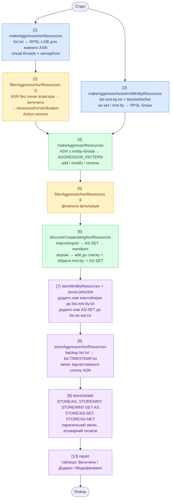

# ASBlockWar

Утиліта для автоматичного супроводу списку ворожих автономних систем (AS), що підлягають блокуванню.

Зчитує поточний перелік ASN, звіряє їх з локальною копією бази RPSL ([whois-lite-local](https://github.com/oldengremlin/whois-lite-local)), знаходить нові ASN через mnt-by/as-set зв'язки та AS-SET-и з import/export-політик, фільтрує за патерном агресора й оновлює список на диску. Після виконання виводить звіт про зміни.

---

## Вимоги

| Компонент | Версія |
|---|---|
| Java | 21+ |
| Maven | 3.6+ |
| [whois-lite-local](https://github.com/oldengremlin/whois-lite-local) | актуальна база `whoislitelocal.db` |

База `whoislitelocal.db` має бути заповнена утилітою `whois-lite-local` до запуску ASBlockWar. Дивись [DATABASE.md](https://github.com/oldengremlin/whois-lite-local/blob/main/docs/DATABASE.md) за структурою схеми.

---

## Збірка

Є два варіанти збірки.

### Варіант 1: fat-JAR (`mvn clean package`)

```bash
mvn clean package
```

Збирається fat-JAR з усіма залежностями (через maven-shade-plugin):

```
target/ASBlockWar-1.0.0-<buildNumber>.jar
```

Запуск потребує встановленої JRE 21+ на цільовій машині:

```bash
java -jar target/ASBlockWar-1.0.0-00000001.jar [параметри]
```

### Варіант 2: native app image (`mvn clean verify`)

```bash
mvn clean verify
```

Окрім fat-JAR, збирається автономний образ застосунку (через jpackage-maven-plugin, тип `APP_IMAGE`) — директорія зі збудованим JRE та власним лаунчером:

```
target/ASBlockWar/
```

Запуск не потребує встановленої JRE:

```bash
target/ASBlockWar/bin/ASBlockWar [параметри]
```

> Якщо Maven не може завантажити залежності через проблеми з IPv6:
> ```bash
> MAVEN_OPTS="-Djava.net.preferIPv4Stack=true" mvn clean verify
> ```

---

## Конфігурація

Конфігураційний файл не є обов'язковим. Якщо він не заданий і не вбудований у JAR, використовуються значення за замовчуванням для всіх властивостей:

```properties
ListFile=list.txt
ListMntbyFile=list.mnt-by.txt
ListAssetFile=list.as-set.txt
WhoisLiteLocalURI=jdbc:sqlite:whoislitelocal.db
StoreDir=./STORE
```

За потреби перед збіркою можна створити файл `src/main/resources/asblockwar.properties` на основі зразка нижче — він вбудовується у JAR при `mvn package` і завантажується з classpath.

```properties
# Шлях до файлу зі списком ASN (по одному числу на рядок)
ListFile=list.txt

# Шлях до файлу зі списком mnt-by хендлів
ListMntbyFile=list.mnt-by.txt

# Шлях до файлу зі списком AS-SET-ів
ListAssetFile=list.as-set.txt

# JDBC URI до бази даних whois-lite-local
WhoisLiteLocalURI=jdbc:sqlite:/path/to/whoislitelocal.db

# Директорія для зберігання RPSL-деталей (aut-num, mntner, routes, as-set)
StoreDir=./STORE
```

Альтернативно — зовнішній конфіг через аргумент `--config=`:

```bash
java -jar ASBlockWar-1.0.0-00000001.jar --config=/etc/asblockwar/asblockwar.properties
```

---

## Вхідні файли

### `list.txt` — список ASN для блокування

По одному числу на рядок. Рядки, що починаються з `#` або `;`, ігноруються.

```
# Список ворожих AS
12389
25159
208398
```

### `list.mnt-by.txt` — список mnt-by хендлів

Кожен хендл — ідентифікатор мейнтейнера RIPE. Рядки-коментарі ігноруються.

```
# Мейнтейнери
ROSNIIROS-MNT
RIPE-NCC-RPSL-MNT-RU
```

---

## Запуск

```bash
java -jar target/ASBlockWar-1.0.0-00000001.jar [параметри]
```

### Параметри командного рядка

| Параметр | Опис |
|---|---|
| `--config=<шлях>` | Зовнішній конфігураційний файл (за замовчуванням — вбудований) |
| `--list-file=<шлях>` | Файл зі списком ASN (за замовчуванням: `list.txt`) |
| `--list-mnt=<шлях>` | Файл зі списком mnt-by хендлів (за замовчуванням: `list.mnt-by.txt`) |
| `--list-asset=<шлях>` | Файл зі списком AS-SET-ів (за замовчуванням: `list.as-set.txt`) |
| `--whois-uri=<uri>` | JDBC URI до бази whois-lite-local (за замовчуванням: `jdbc:sqlite:whoislitelocal.db`) |
| `--store-dir=<шлях>` | Директорія для STORE-файлів (за замовчуванням: `./STORE`) |
| `--recursive-asset` | Рекурсивно заходити у вкладені AS-SET-и (глибина 1) |
| `--recursive-asset=N` | Рекурсія до глибини N |
| `-h`, `--help` | Вивести довідку та вийти |

---

## Алгоритм роботи



**Легенда:**
🔵 синій — вхідні дані (M1, M2) &nbsp;
🟡 жовтий — фільтри (F1, F2) &nbsp;
🟢 зелений — обробка (MR, DC) &nbsp;
🟣 фіолетовий — вивід (SM, ST, SD, RP)

### Патерн агресора

ASN вважається ворожим, якщо його RPSL-блок містить хоча б один з рядків:

| Атрибут | Критерій |
|---|---|
| `org-name:` | містить `Kaspersky` або `Qrator` |
| `country:` | містить `ru` |
| `address:` | містить `moscow`, `moskow`, `russia`, `rusia` тощо |
| `abuse-mailbox:` | закінчується на `.ru` |

### Вбудовані AS-SET-и (blockedAsSet)

Завжди перевіряються незалежно від `list.mnt-by.txt`:

- `AS-MAILRU`, `AS-VK`, `AS-VKONTAKTE`, `AS-YANDEX`, `AS-M100`

---

## Вихідні файли

### Оновлений `list.txt`

Після успішного виконання `list.txt` замінюється відфільтрованим, чисельно відсортованим списком:

```
12389
25159
208398
```

### Резервна копія

Перед перезаписом поточний файл зберігається поряд:

```
list.2026-07-06T22:15:00+03:00.txt
```

### Оновлений `list.mnt-by.txt`

Нові мантейнери, знайдені через import/export AS-SET-ів, дописуються в кінець файлу (без дублювання, службові `RIPE-*` виключаються).

### Оновлений `list.as-set.txt`

AS-SET-и, виявлені при обході import/export-політик ворожих ASN, дописуються в кінець файлу (без дублювання). Також завжди включаються вбудовані AS-SET-и (`AS-MAILRU`, `AS-VK`, `AS-YANDEX` тощо).

### Директорія `STORE/`

Детальні RPSL-дані зберігаються у підкаталогах з правами `0750`. Кожен файл записується атомарно (через тимчасовий файл + перейменування):

```
STORE/
├── AS/
│   └── 12345.txt          # aut-num блок + резюме з asn-таблиці + org блок
├── MNT/
│   └── EXAMPLE-MNT.txt    # mntner блок + пов'язані role-блоки
├── MNT-SET-AS/
│   └── EXAMPLE-MNT.txt    # aut-num / as-set об'єкти, що обслуговуються мантейнером
├── AS-SET/
│   └── AS-EXAMPLE.txt     # as-set блок
└── AS-NET/
    └── 12345.txt          # всі route / route6 блоки для AS
```

Вміст файлів відповідає виводу `whois-lite-local`:

| Директорія | Еквівалент wll | Опис |
|---|---|---|
| `STORE/AS/` | `-ran {as}` | aut-num + org |
| `STORE/MNT/` | `-rm {mnt}` | mntner + role |
| `STORE/MNT-SET-AS/` | `-rmb {mnt}` | aut-num/as-set під мантейнером |
| `STORE/AS-SET/` | `-ras {asset}` | as-set |
| `STORE/AS-NET/` | `-rro {as}` | route/route6 |

---

## Логування

| Потік | Рівні | Призначення |
|---|---|---|
| Консоль | `INFO`, `ERROR` | Прогрес виконання |
| `logs/jAS12593Backup.log` | `DEBUG` і вище | Детальний лог з ротацією (10 МБ / 30 днів) |

Зміни (вилучено / додано / модифіковано) виводяться у вигляді таблиці в `INFO`:

```
Вилучено     │ Додано      │ Модифіковано
3            │ 7           │ 1
━━━━━━━━━━━━━┿━━━━━━━━━━━━━┿━━━━━━━━━━━━━
AS1234       │ AS5678      │ AS9012
AS2345       │ AS6789      │
             │ AS7890      │
```

---

## Паралелізм

Утиліта використовує Java 21 Virtual Threads (`Executors.newVirtualThreadPerTaskExecutor()`) для паралельних запитів до БД. Кількість одночасних з'єднань обмежена семафором (`MAX_CONCURRENT_DB_QUERIES = 20`).

---

## Зв'язані проекти

- [whois-lite-local](https://github.com/oldengremlin/whois-lite-local) — локальна RPSL-база даних (SQLite), яку використовує ASBlockWar як джерело даних.

---

## Ліцензія

Apache License 2.0 — див. [LICENSE](LICENSE).
